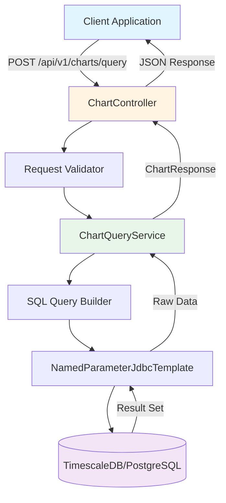
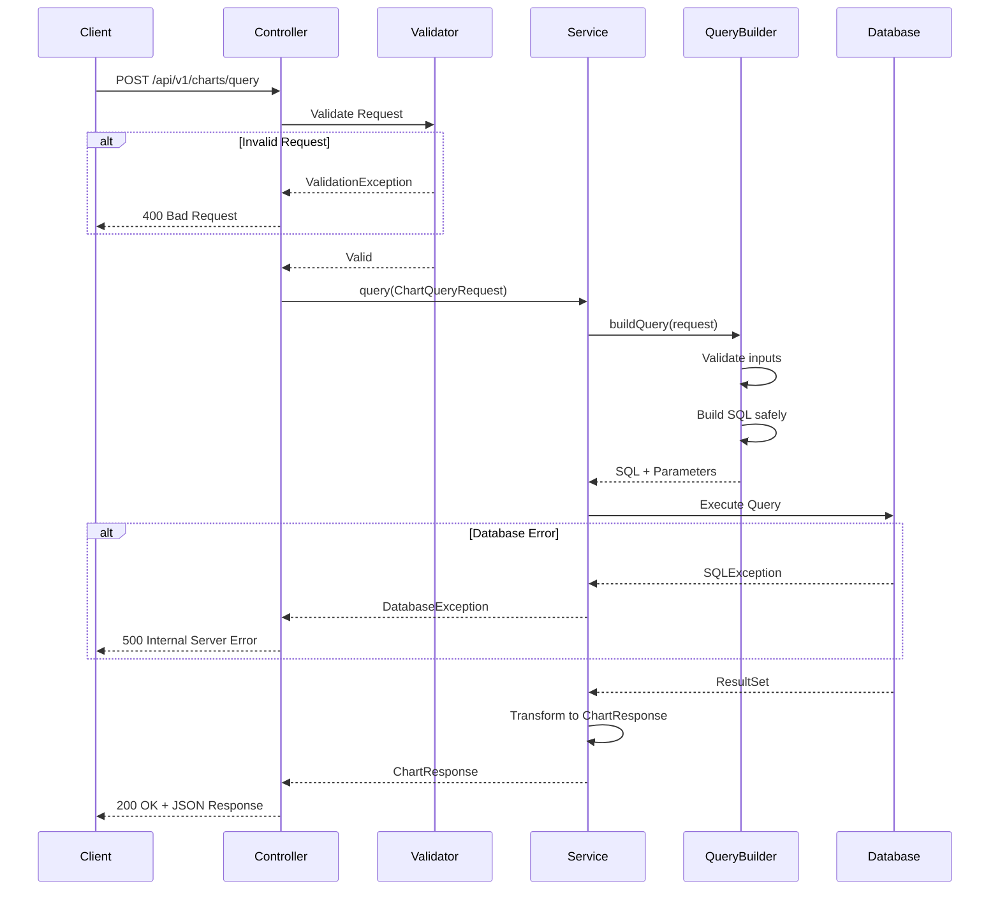

# TimescaleDB Charting API - Project Plan

## 📋 Project Overview

A Spring Boot 3.x REST API for querying and visualizing health metrics stored in TimescaleDB. The API provides flexible charting capabilities with support for multiple metric types, time-based aggregations, and dynamic query generation.

**Technology Stack:**
- Java 17+
- Spring Boot 3.x
- Maven
- TimescaleDB (PostgreSQL extension)
- Lombok
- Springdoc OpenAPI (Swagger)

---

## 🗄️ Database Schema

### Tables Overview

The system manages 7 health metric tables with similar schemas:

1. **activity** - Physical activity metrics (steps, distance, calories)
2. **bloodpressure** - Blood pressure readings (systolic, diastolic)
3. **devices** - Device information and metadata
4. **glucose** - Blood glucose measurements
5. **heartrate** - Heart rate measurements
6. **sleep** - Sleep tracking data
7. **spo2** - Blood oxygen saturation levels
8. **workout** - Workout session data

### Common Table Structure

```sql
CREATE TABLE IF NOT EXISTS public.{metric_type}
(
    request_id text,
    device_id text,
    user_id text NOT NULL,
    scope_name text,
    scope_version text,
    metric_name text NOT NULL,
    unit text,
    attributes jsonb,
    start_time bigint,
    "time" bigint NOT NULL,
    metric_value double precision,
    ingestion_timestamp timestamp without time zone,
    ingestion_time timestamp without time zone,
    schema_version text COLLATE pg_catalog."default",
    CONSTRAINT {metric_type}_pkey PRIMARY KEY ("time", user_id, metric_name)
)
```

**Key Fields:**
- `time`: Unix timestamp in milliseconds (primary key component)
- `user_id`: User identifier (primary key component)
- `metric_name`: Specific metric identifier (primary key component)
- `metric_value`: Numeric value of the measurement
- `attributes`: JSONB field for flexible metadata

---

## 🏗️ System Architecture

### Architecture Diagram



### Layered Architecture

```
┌─────────────────────────────────────┐
│     Presentation Layer              │
│  - ChartController                  │
│  - Request/Response DTOs            │
│  - Validation                       │
└─────────────────────────────────────┘
              ↓
┌─────────────────────────────────────┐
│     Service Layer                   │
│  - ChartQueryService                │
│  - Business Logic                   │
│  - Data Transformation              │
└─────────────────────────────────────┘
              ↓
┌─────────────────────────────────────┐
│     Data Access Layer               │
│  - SqlQueryBuilder                  │
│  - NamedParameterJdbcTemplate       │
│  - Query Execution                  │
└─────────────────────────────────────┘
              ↓
┌─────────────────────────────────────┐
│     Database Layer                  │
│  - TimescaleDB/PostgreSQL           │
└─────────────────────────────────────┘
```

---

## 📁 Project Structure

```
ChartingAPI/
├── src/
│   ├── main/
│   │   ├── java/
│   │   │   └── com/
│   │   │       └── health/
│   │   │           └── charting/
│   │   │               ├── ChartingApiApplication.java
│   │   │               ├── config/
│   │   │               │   ├── DatabaseConfig.java
│   │   │               │   └── OpenApiConfig.java
│   │   │               ├── controller/
│   │   │               │   └── ChartController.java
│   │   │               ├── dto/
│   │   │               │   ├── request/
│   │   │               │   │   ├── ChartQueryRequest.java
│   │   │               │   │   ├── SeriesSpec.java
│   │   │               │   │   └── TimeRange.java
│   │   │               │   └── response/
│   │   │               │       ├── ChartResponse.java
│   │   │               │       ├── Series.java
│   │   │               │       └── DataPoint.java
│   │   │               ├── enums/
│   │   │               │   ├── MetricType.java
│   │   │               │   ├── Aggregation.java
│   │   │               │   ├── Resolution.java
│   │   │               │   └── ChartType.java
│   │   │               ├── service/
│   │   │               │   ├── ChartQueryService.java
│   │   │               │   └── impl/
│   │   │               │       └── ChartQueryServiceImpl.java
│   │   │               ├── util/
│   │   │               │   └── SqlQueryBuilder.java
│   │   │               └── exception/
│   │   │                   ├── GlobalExceptionHandler.java
│   │   │                   ├── InvalidQueryException.java
│   │   │                   └── DataNotFoundException.java
│   │   └── resources/
│   │       ├── application.properties
│   │       └── application-dev.properties
│   └── test/
│       └── java/
│           └── com/
│               └── health/
│                   └── charting/
│                       ├── service/
│                       │   └── ChartQueryServiceTest.java
│                       └── controller/
│                           └── ChartControllerTest.java
├── pom.xml
├── README.md
└── ProjectPlan.md (this file)
```

---

## 🔌 API Specification

### Endpoint

**POST** `/api/v1/charts/query`

### Request DTO

```java
public class ChartQueryRequest {
    private String userId;              // Required: User identifier
    private MetricType metricType;      // Required: Type of metric to query
    private TimeRange timeRange;        // Required: Time window for data
    private Resolution resolution;      // Optional: Time bucketing resolution
    private Aggregation aggregation;    // Optional: Default aggregation function
    private List<SeriesSpec> series;    // Required: Series specifications
}

public record TimeRange(
    long from,    // Unix timestamp in milliseconds
    long to       // Unix timestamp in milliseconds
) {}

public class SeriesSpec {
    private String name;                        // Display name for the series
    private String metricName;                  // Specific metric to query
    private Map<String, String> attributeFilter; // JSONB attribute filters
    private Aggregation aggregation;            // Series-specific aggregation
}
```

### Response DTO

```java
public class ChartResponse {
    private ChartType chartType;    // LINE or BAR
    private String xAxis;           // "time"
    private List<Series> series;    // Data series
}

public class Series {
    private String name;            // Series display name
    private List<DataPoint> points; // Time-series data points
}

public record DataPoint(
    long timestamp,     // Unix timestamp in milliseconds
    Double value        // Metric value
) {}
```

### Enums

```java
public enum MetricType {
    HEARTRATE("heartrate"),
    GLUCOSE("glucose"),
    SPO2("spo2"),
    BLOODPRESSURE("bloodpressure"),
    SLEEP("sleep"),
    ACTIVITY("activity"),
    WORKOUT("workout");
}

public enum Resolution {
    RAW,        // No time bucketing
    MINUTE,     // 1-minute buckets
    FIVE_MIN,   // 5-minute buckets
    HOUR,       // 1-hour buckets
    DAY         // 1-day buckets
}

public enum Aggregation {
    AVG,    // Average value
    MIN,    // Minimum value
    MAX,    // Maximum value
    SUM,    // Sum of values
    COUNT,  // Count of records
    P50,    // 50th percentile (median)
    P95,    // 95th percentile
    P99     // 99th percentile
}

public enum ChartType {
    LINE,   // Line chart
    BAR     // Bar chart
}
```

---

## 📊 Sample Requests and SQL Queries

### Example 1: Heart Rate Trends (Line Chart)

**Request:**
```json
{
  "userId": "u1",
  "metricType": "HEARTRATE",
  "timeRange": {
    "from": 1707264000000,
    "to": 1707350399000
  },
  "resolution": "FIVE_MIN",
  "aggregation": "AVG",
  "series": [
    {
      "name": "Heart Rate",
      "metricName": "heartrate",
      "aggregation": "AVG"
    }
  ]
}
```

**Generated SQL:**
```sql
SELECT
  time_bucket('5 minutes', to_timestamp(time/1000)) AS bucket,
  AVG(metric_value) AS value
FROM heartrate
WHERE user_id = :userId
  AND time >= :fromTime
  AND time <= :toTime
  AND metric_name = :metricName
GROUP BY bucket
ORDER BY bucket;
```

### Example 2: Blood Pressure History (Multi-Series)

**Request:**
```json
{
  "userId": "u1",
  "metricType": "BLOODPRESSURE",
  "timeRange": {
    "from": 1706659200000,
    "to": 1707264000000
  },
  "resolution": "DAY",
  "series": [
    {
      "name": "Systolic",
      "metricName": "systolic",
      "aggregation": "AVG"
    },
    {
      "name": "Diastolic",
      "metricName": "diastolic",
      "aggregation": "AVG"
    }
  ]
}
```

**Generated SQL:**
```sql
SELECT
  time_bucket('1 day', to_timestamp(time/1000)) AS bucket,
  metric_name,
  AVG(metric_value) AS value
FROM bloodpressure
WHERE user_id = :userId
  AND time >= :fromTime
  AND time <= :toTime
  AND metric_name IN (:metricNames)
GROUP BY bucket, metric_name
ORDER BY bucket;
```

### Example 3: Activity Summary (Bar Chart)

**Request:**
```json
{
  "userId": "u1",
  "metricType": "ACTIVITY",
  "timeRange": {
    "from": 1706659200000,
    "to": 1707264000000
  },
  "resolution": "DAY",
  "aggregation": "SUM",
  "series": [
    {
      "name": "Steps",
      "metricName": "steps",
      "aggregation": "SUM"
    }
  ]
}
```

**Generated SQL:**
```sql
SELECT
  time_bucket('1 day', to_timestamp(time/1000)) AS bucket,
  SUM(metric_value) AS value
FROM activity
WHERE user_id = :userId
  AND time >= :fromTime
  AND time <= :toTime
  AND metric_name = :metricName
GROUP BY bucket
ORDER BY bucket;
```

---

## 🔄 Data Flow Sequence



---

## 🛠️ Implementation Strategy

### 1. Query Generation Logic

```mermaid
graph LR
    Request[ChartQueryRequest]
    Validate[Validate Inputs]
    BuildBase[Build Base Query]
    AddFilters[Add WHERE Filters]
    AddBucket[Add Time Bucket]
    AddAgg[Add Aggregation]
    AddGroup[Add GROUP BY]
    Execute[Execute Query]
    Transform[Transform Results]
    
    Request --> Validate
    Validate --> BuildBase
    BuildBase --> AddFilters
    AddFilters --> AddBucket
    AddBucket --> AddAgg
    AddAgg --> AddGroup
    AddGroup --> Execute
    Execute --> Transform
    
    style Request fill:#e1f5ff
    style Execute fill:#fff4e1
    style Transform fill:#e8f5e9
```



### 2. Time Bucket Resolution Mapping

| Resolution | TimescaleDB Function |
|-----------|---------------------|
| RAW | No bucketing, use raw `time` field |
| MINUTE | `time_bucket('1 minute', to_timestamp(time/1000))` |
| FIVE_MIN | `time_bucket('5 minutes', to_timestamp(time/1000))` |
| HOUR | `time_bucket('1 hour', to_timestamp(time/1000))` |
| DAY | `time_bucket('1 day', to_timestamp(time/1000))` |

### 3. Aggregation Function Mapping

| Aggregation | SQL Function |
|------------|-------------|
| AVG | `AVG(metric_value)` |
| MIN | `MIN(metric_value)` |
| MAX | `MAX(metric_value)` |
| SUM | `SUM(metric_value)` |
| COUNT | `COUNT(*)` |
| P50 | `PERCENTILE_CONT(0.5) WITHIN GROUP (ORDER BY metric_value)` |
| P95 | `PERCENTILE_CONT(0.95) WITHIN GROUP (ORDER BY metric_value)` |
| P99 | `PERCENTILE_CONT(0.99) WITHIN GROUP (ORDER BY metric_value)` |

### 4. Attribute Filter Handling

For JSONB attribute filtering:
```sql
WHERE attributes @> '{"device_type": "Apple Watch"}'::jsonb
```

Multiple filters:
```sql
WHERE attributes @> '{"device_type": "Apple Watch", "position": "left_wrist"}'::jsonb
```

### 5. Multi-Series Query Strategy

**Option A: Single Query with UNION**
```sql
SELECT 'Systolic' as series_name, bucket, value FROM (...)
UNION ALL
SELECT 'Diastolic' as series_name, bucket, value FROM (...)
ORDER BY bucket, series_name;
```

**Option B: Separate Queries (Recommended)**
- Execute one query per series
- Merge results in service layer
- Better for different aggregations per series
- Easier to debug and maintain

---

## 🔒 Security Considerations

### SQL Injection Prevention

1. **Parameterized Queries Only**
   - Use `NamedParameterJdbcTemplate` exclusively
   - Never concatenate user input into SQL strings

2. **Whitelist Validation**
   - Table names: Validate against `MetricType` enum
   - Column names: Hardcoded in query builder
   - Functions: Validate against `Aggregation` enum
   - Resolution: Validate against `Resolution` enum

3. **Input Sanitization**
   ```java
   // Example validation
   if (!ALLOWED_TABLES.contains(tableName)) {
       throw new InvalidQueryException("Invalid table name");
   }
   ```

### Request Validation

1. **Time Range Validation**
   - Ensure `from < to`
   - Limit maximum time range (e.g., 1 year)
   - Validate timestamps are positive

2. **Series Validation**
   - Minimum 1 series required
   - Maximum 10 series per request
   - Validate metric names exist in table

3. **Attribute Filter Validation**
   - Validate JSON structure
   - Limit filter complexity
   - Prevent nested JSONB queries

---

## ⚡ Performance Optimizations

### Database Optimizations

1. **Indexes**
   ```sql
   CREATE INDEX idx_heartrate_user_time 
   ON heartrate (user_id, time DESC);
   
   CREATE INDEX idx_heartrate_user_metric_time 
   ON heartrate (user_id, metric_name, time DESC);
   ```

2. **TimescaleDB Hypertables**
   - Ensure tables are converted to hypertables
   - Configure appropriate chunk time intervals
   - Enable compression for older data

3. **Query Optimization**
   - Use `EXPLAIN ANALYZE` for query tuning
   - Leverage TimescaleDB's time_bucket optimization
   - Consider materialized views for common queries

### Application Optimizations

1. **Connection Pooling (HikariCP)**
   ```properties
   spring.datasource.hikari.maximum-pool-size=10
   spring.datasource.hikari.minimum-idle=5
   spring.datasource.hikari.connection-timeout=30000
   spring.datasource.hikari.idle-timeout=600000
   spring.datasource.hikari.max-lifetime=1800000
   ```

2. **Result Set Handling**
   - Stream large result sets
   - Limit maximum result size
   - Use pagination for large datasets

3. **Caching Strategy (Future)**
   - Cache frequently accessed queries
   - Use Redis for distributed caching
   - Implement cache invalidation strategy

---

## 🧪 Testing Strategy

### Unit Tests

1. **SQL Query Builder Tests**
   ```java
   @Test
   void testBuildQueryWithResolution() {
       // Test time bucket generation
   }
   
   @Test
   void testBuildQueryWithAggregation() {
       // Test aggregation function mapping
   }
   
   @Test
   void testBuildQueryWithAttributeFilters() {
       // Test JSONB filter generation
   }
   ```

2. **Service Layer Tests**
   ```java
   @Test
   void testQuerySingleSeries() {
       // Test single series query
   }
   
   @Test
   void testQueryMultipleSeries() {
       // Test multi-series query
   }
   ```

### Integration Tests

1. **Controller Tests**
   ```java
   @SpringBootTest
   @AutoConfigureMockMvc
   class ChartControllerTest {
       @Test
       void testQueryEndpoint() {
           // Test full request/response cycle
       }
   }
   ```

2. **Database Tests**
   - Use Testcontainers for PostgreSQL
   - Test with actual TimescaleDB instance
   - Verify query performance

### Test Data

```sql
-- Sample test data
INSERT INTO heartrate (user_id, metric_name, time, metric_value)
VALUES 
  ('u1', 'heartrate', 1707264000000, 72.0),
  ('u1', 'heartrate', 1707264300000, 75.0),
  ('u1', 'heartrate', 1707264600000, 78.0);
```

---

## 📦 Maven Dependencies

```xml
<dependencies>
    <!-- Spring Boot Starters -->
    <dependency>
        <groupId>org.springframework.boot</groupId>
        <artifactId>spring-boot-starter-web</artifactId>
    </dependency>
    
    <dependency>
        <groupId>org.springframework.boot</groupId>
        <artifactId>spring-boot-starter-jdbc</artifactId>
    </dependency>
    
    <dependency>
        <groupId>org.springframework.boot</groupId>
        <artifactId>spring-boot-starter-validation</artifactId>
    </dependency>
    
    <!-- Database -->
    <dependency>
        <groupId>org.postgresql</groupId>
        <artifactId>postgresql</artifactId>
        <scope>runtime</scope>
    </dependency>
    
    <!-- Utilities -->
    <dependency>
        <groupId>org.projectlombok</groupId>
        <artifactId>lombok</artifactId>
        <optional>true</optional>
    </dependency>
    
    <!-- API Documentation -->
    <dependency>
        <groupId>org.springdoc</groupId>
        <artifactId>springdoc-openapi-starter-webmvc-ui</artifactId>
        <version>2.3.0</version>
    </dependency>
    
    <!-- Testing -->
    <dependency>
        <groupId>org.springframework.boot</groupId>
        <artifactId>spring-boot-starter-test</artifactId>
        <scope>test</scope>
    </dependency>
</dependencies>
```

---

## ⚙️ Configuration

### application.properties

```properties
# Application
spring.application.name=charting-api
server.port=8080

# Database Configuration
spring.datasource.url=jdbc:postgresql://localhost:5432/healthdb
spring.datasource.username=postgres
spring.datasource.password=password
spring.datasource.driver-class-name=org.postgresql.Driver

# HikariCP Connection Pool
spring.datasource.hikari.maximum-pool-size=10
spring.datasource.hikari.minimum-idle=5
spring.datasource.hikari.connection-timeout=30000
spring.datasource.hikari.idle-timeout=600000
spring.datasource.hikari.max-lifetime=1800000

# Logging
logging.level.root=INFO
logging.level.com.health.charting=DEBUG
logging.level.org.springframework.jdbc=DEBUG
logging.pattern.console=%d{yyyy-MM-dd HH:mm:ss} - %msg%n

# OpenAPI/Swagger
springdoc.api-docs.path=/v3/api-docs
springdoc.swagger-ui.path=/swagger-ui.html
springdoc.swagger-ui.operationsSorter=method
```

### application-dev.properties

```properties
# Development-specific settings
spring.datasource.url=jdbc:postgresql://localhost:5432/healthdb_dev
logging.level.com.health.charting=TRACE
```

---

## 🚀 Deployment Considerations

### Environment Variables

```bash
# Production environment variables
export DB_HOST=prod-db.example.com
export DB_PORT=5432
export DB_NAME=healthdb
export DB_USERNAME=app_user
export DB_PASSWORD=secure_password
export SERVER_PORT=8080
```

### Docker Support (Future)

```dockerfile
FROM eclipse-temurin:17-jre-alpine
WORKDIR /app
COPY target/charting-api.jar app.jar
EXPOSE 8080
ENTRYPOINT ["java", "-jar", "app.jar"]
```

### Health Checks

```java
@RestController
@RequestMapping("/actuator")
public class HealthController {
    @GetMapping("/health")
    public ResponseEntity<String> health() {
        return ResponseEntity.ok("UP");
    }
}
```

---

## 📝 Implementation Checklist

### Phase 1: Project Setup
- [ ] Create Maven project structure with Spring Boot 3.x parent POM
- [ ] Add required dependencies (Spring Boot Web, JDBC, PostgreSQL, Validation, Lombok, Springdoc OpenAPI)
- [ ] Create application.properties with TimescaleDB connection configuration
- [ ] Set up project package structure

### Phase 2: Domain Models
- [ ] Implement enums (MetricType, Aggregation, Resolution, ChartType)
- [ ] Create request DTOs (ChartQueryRequest, SeriesSpec, TimeRange)
- [ ] Create response DTOs (ChartResponse, Series, DataPoint)
- [ ] Add validation annotations to DTOs

### Phase 3: Core Services
- [ ] Create database configuration class for NamedParameterJdbcTemplate
- [ ] Implement ChartQueryService interface
- [ ] Implement SqlQueryBuilder utility for safe dynamic query construction
- [ ] Implement time bucket resolution mapping
- [ ] Implement aggregation function mapping
- [ ] Add attribute filter handling for JSONB queries
- [ ] Implement ChartQueryServiceImpl with dynamic SQL generation logic

### Phase 4: API Layer
- [ ] Create ChartController with POST /api/v1/charts/query endpoint
- [ ] Add request validation and custom validators
- [ ] Implement global exception handler for error responses
- [ ] Add logging with SLF4J throughout the application

### Phase 5: Documentation & Testing
- [ ] Configure Swagger/OpenAPI documentation
- [ ] Create README.md with API documentation and setup instructions
- [ ] Add example requests and responses in documentation
- [ ] Write unit tests for query builder
- [ ] Write integration tests for controller
- [ ] Add test data and test scenarios

---

## 🎯 Success Criteria

1. **Functional Requirements**
   - ✅ API accepts POST requests at `/api/v1/charts/query`
   - ✅ Supports all 7 metric types
   - ✅ Handles multiple series in single request
   - ✅ Generates correct TimescaleDB queries
   - ✅ Returns properly formatted chart data

2. **Non-Functional Requirements**
   - ✅ Query response time < 2 seconds for typical requests
   - ✅ Handles up to 10 concurrent requests
   - ✅ Proper error handling and validation
   - ✅ Comprehensive API documentation
   - ✅ SQL injection protection

3. **Code Quality**
   - ✅ Clean, maintainable code structure
   - ✅ Comprehensive unit test coverage (>80%)
   - ✅ Integration tests for critical paths
   - ✅ Proper logging and monitoring

---

## 📚 Additional Resources

### TimescaleDB Documentation
- [Time Bucketing](https://docs.timescale.com/api/latest/hyperfunctions/time_bucket/)
- [Continuous Aggregates](https://docs.timescale.com/use-timescale/latest/continuous-aggregates/)
- [Query Optimization](https://docs.timescale.com/use-timescale/latest/query-data/)

### Spring Boot Documentation
- [Spring JDBC](https://docs.spring.io/spring-framework/reference/data-access/jdbc.html)
- [Validation](https://docs.spring.io/spring-framework/reference/core/validation/beanvalidation.html)
- [Exception Handling](https://spring.io/blog/2013/11/01/exception-handling-in-spring-mvc)

### Best Practices
- [REST API Design](https://restfulapi.net/)
- [SQL Injection Prevention](https://cheatsheetseries.owasp.org/cheatsheets/SQL_Injection_Prevention_Cheat_Sheet.html)
- [Java Coding Standards](https://google.github.io/styleguide/javaguide.html)

---

## 🔄 Future Enhancements

1. **Caching Layer**
   - Implement Redis caching for frequent queries
   - Cache invalidation strategy
   - TTL-based cache expiration

2. **Advanced Features**
   - Support for custom date ranges (last 7 days, last month, etc.)
   - Export to CSV/Excel
   - Real-time data streaming with WebSockets
   - Anomaly detection in time-series data

3. **Performance**
   - Query result pagination
   - Async query execution for large datasets
   - Query result compression

4. **Monitoring**
   - Prometheus metrics integration
   - Query performance tracking
   - Alert system for slow queries

5. **Security**
   - JWT authentication
   - Role-based access control
   - Rate limiting per user
   - Audit logging

---

## 📞 Support & Maintenance

### Logging Strategy
- **DEBUG**: SQL queries and parameters
- **INFO**: Request/response summaries
- **WARN**: Validation failures, slow queries
- **ERROR**: Database errors, unexpected exceptions

### Monitoring Metrics
- Request count per endpoint
- Average response time
- Database connection pool usage
- Error rate by type
- Query execution time distribution

### Troubleshooting Guide
1. **Slow Queries**: Check EXPLAIN ANALYZE output
2. **Connection Pool Exhaustion**: Review pool configuration
3. **Validation Errors**: Check request payload format
4. **Database Errors**: Verify TimescaleDB extension is enabled

---

**Document Version:** 1.0  
**Last Updated:** 2026-02-07  
**Author:** IBM Bob (Plan Mode)